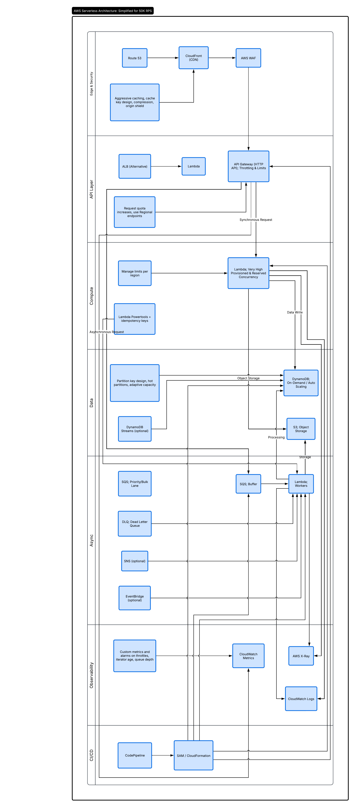

# Lambda Hybrid 50K RPS on AWS

This stack is a Terraform implementation of the attached 50K RPS hybrid serverless scheme with a direct resource mapping wherever AWS exposes the component as infrastructure.



Implemented request paths:

- sync path: `Route 53 -> CloudFront -> WAF -> API Gateway -> Lambda -> DynamoDB/S3`
- sync alternative path: `ALB -> Lambda -> DynamoDB/S3`
- buffered async path: `API Gateway -> SQS Buffer -> Lambda Workers -> DynamoDB/S3`
- priority async path: `API Gateway -> SQS Priority -> Lambda Workers -> DynamoDB/S3`
- bulk async path: `API Gateway -> SQS Bulk -> Lambda Workers -> DynamoDB/S3`
- fan-in path: `SNS -> SQS Buffer -> Lambda Workers`
- event path: `EventBridge -> SQS Buffer -> Lambda Workers`
- resilience path: `Any async queue -> DLQ`

## What Gets Created

- `API Gateway HTTP API`
- `POST /sync` route for synchronous execution
- `POST /async` route for buffered asynchronous ingestion
- `POST /async/priority` route for the priority lane
- `POST /async/bulk` route for the bulk lane
- sync `Lambda`
- async worker `Lambda` with alias-based provisioned concurrency
- `SQS` buffer queue
- optional `SQS` priority queue
- optional `SQS` bulk queue
- shared `SQS` DLQ
- `DynamoDB` request table in on-demand mode with optional Streams and PITR
- `S3` payload bucket with versioning
- optional customer-managed `KMS` key for data services
- `CloudWatch` log groups, alarms, and dashboard
- `AWS X-Ray` tracing for Lambda functions
- optional `SNS` topic feeding the buffer queue
- optional custom `EventBridge` bus feeding the buffer queue
- optional `WAF` attached to CloudFront or directly to API Gateway
- optional `CloudFront` distribution with compression, custom cache policy, and Origin Shield
- optional `Route 53` alias and `ACM` certificate for the edge domain
- optional `ALB` that invokes the sync Lambda as an alternative ingress
- optional `CodePipeline` plus `CodeBuild` packaging path for `SAM/CloudFormation`

## 1:1 Mapping From The Diagram

`Edge & Security`

- `Route 53` -> `aws_route53_record.edge_alias`
- `CloudFront (CDN)` -> `aws_cloudfront_distribution.edge`
- `Aggressive caching, cache key design, compression, origin shield` -> `aws_cloudfront_cache_policy.edge_api` plus `compress = true` and optional `origin_shield` in the distribution origin
- `AWS WAF` -> `aws_wafv2_web_acl.edge` or `aws_wafv2_web_acl.regional`

`API Layer`

- `API Gateway (HTTP API), throttling & limits` -> `aws_apigatewayv2_api.this`, `aws_apigatewayv2_stage.this`
- `ALB (Alternative)` -> `aws_lb.sync`, `aws_lb_target_group.sync_lambda`, `aws_lb_listener.sync`
- `Request quota increases, use Regional endpoints` -> HTTP API stays regional by default; quota increases remain an AWS account-level operational step and are documented, not provisioned by Terraform

`Compute`

- `Lambda; very high provisioned & reserved concurrency` -> `aws_lambda_function.sync`, `aws_lambda_function.worker`, aliases, and `aws_lambda_provisioned_concurrency_config`
- `Manage limits per region` -> represented by configurable concurrency values in Terraform; regional account quota increases remain operational requests
- `Lambda Powertools + idempotency keys` -> sample handlers implement idempotent request claiming in DynamoDB using `request_id`; this is the same control point shown in the diagram even though the sample code does not vendor the Powertools library

`Data`

- `DynamoDB; On-Demand / Auto-Scaling` -> `aws_dynamodb_table.requests` in `PAY_PER_REQUEST`
- `Partition key design, hot partitions, adaptive capacity` -> captured as an application/data-model concern and documented here; Terraform creates the table, but key distribution still depends on the chosen `request_id`
- `DynamoDB Streams (optional)` -> `stream_enabled` and `stream_view_type` on the table
- `S3; Object Storage` -> `aws_s3_bucket.payloads`

`Async`

- `SQS; Buffer` -> `aws_sqs_queue.buffer`
- `SQS; Priority/Bulk Lane` -> `aws_sqs_queue.priority` and `aws_sqs_queue.bulk`
- `DLQ; Dead Letter Queue` -> `aws_sqs_queue.async_dlq`
- `SNS (optional)` -> `aws_sns_topic.async_ingress` and `aws_sns_topic_subscription.buffer`
- `EventBridge (optional)` -> `aws_cloudwatch_event_bus.async_ingress`, `aws_cloudwatch_event_rule.async_ingress`, `aws_cloudwatch_event_target.buffer`
- `Lambda; Workers` -> one worker function with multiple SQS event source mappings; concurrency creates the effective worker fleet shown in the diagram

`Observability`

- `Custom metrics and alarms on throttles, iterator age, queue depth` -> CloudWatch alarms and dashboard widgets for Lambda throttles/errors, API `5xx`, queue depth, and queue age
- `CloudWatch Metrics` -> native service metrics surfaced via alarms and dashboard
- `CloudWatch Logs` -> Lambda, API Gateway, and optional WAF log groups
- `AWS X-Ray` -> active tracing on Lambda functions

`CI/CD`

- `CodePipeline` -> `aws_codepipeline.sam_deploy`
- `SAM / CloudFormation` -> `sam/template.yaml`, `sam/buildspec.yml`, and the pipeline deploy stage

## Structure

- `versions.tf` - Terraform and provider versions
- `providers.tf` - AWS providers, including `us-east-1` for edge resources
- `variables.tf` - stack settings, queue lanes, observability, edge, and ingress flags
- `locals.tf` - shared naming and tags
- `main.tf` - infrastructure resources
- `outputs.tf` - API, queue, edge, observability, and CI/CD outputs
- `terraform.tfvars.example` - example variables
- `src/sync_handler.py` - sync Lambda sample with idempotent writes
- `src/worker_handler.py` - worker Lambda sample shared by buffer, priority, and bulk lanes
- `sam/template.yaml` - optional SAM template used by the CI/CD scaffold
- `sam/buildspec.yml` - CodeBuild packaging steps for the SAM deployment path
- `scheme/` - architecture image

## Key Notes

- `Workers` in the diagram are represented by concurrent executions of the single worker Lambda function.
- The stack creates all infrastructure parts of the scheme directly in Terraform.
- Two boxes in the scheme are operational rather than declarative resources: service quota increases and partition-key design. Those are documented, but the actual decisions happen outside Terraform or in application design.
- The optional ALB path requires at least two subnet IDs and usually a security group.
- Customer-managed `KMS` is available but disabled by default because it introduces extra permissions for cross-service producers.

## Quick Start

1. Go to the stack folder:

```bash
cd lambda_hybrid_50K_PRS
```

2. Create a variables file:

```bash
cp terraform.tfvars.example terraform.tfvars
```

3. Adjust values in `terraform.tfvars`.

4. If you want the full edge layer, set at least:

```hcl
enable_edge_layer = true
route53_zone_name = "example.com"
edge_domain_name  = "api.example.com"
```

5. If you want the ALB alternative path, set:

```hcl
enable_alb_ingress     = true
alb_subnet_ids         = ["subnet-aaaa1111", "subnet-bbbb2222"]
alb_security_group_ids = ["sg-0123456789abcdef0"]
```

6. Initialize and apply:

```bash
terraform init
terraform fmt -recursive
terraform plan
terraform apply
```

## Invocation Examples

After `apply`, Terraform outputs:

- `sync_invoke_url`
- `buffer_async_invoke_url`
- `priority_async_invoke_url`
- `bulk_async_invoke_url`
- `edge_url` when the edge layer is enabled

Synchronous request:

```bash
curl -X POST "$SYNC_URL" \
	-H "content-type: application/json" \
	-d '{"request_id":"sync-001","type":"sync","payload":{"hello":"world"}}'
```

Buffered asynchronous request:

```bash
curl -X POST "$BUFFER_URL" \
	-H "content-type: application/json" \
	-d '{"request_id":"async-001","type":"async","payload":{"hello":"buffer"}}'
```

Priority asynchronous request:

```bash
curl -X POST "$PRIORITY_URL" \
	-H "content-type: application/json" \
	-d '{"request_id":"prio-001","priority":"high","payload":{"hello":"priority"}}'
```

Bulk asynchronous request:

```bash
curl -X POST "$BULK_URL" \
	-H "content-type: application/json" \
	-d '{"request_id":"bulk-001","batch_id":"batch-42","payload":{"hello":"bulk"}}'
```

EventBridge example:

```bash
aws events put-events --entries '[{"Source":"custom.lambda-hybrid","DetailType":"async-request","Detail":"{\"request_id\":\"evt-001\",\"payload\":{\"hello\":\"bus\"}}","EventBusName":"REPLACE_ME"}]'
```