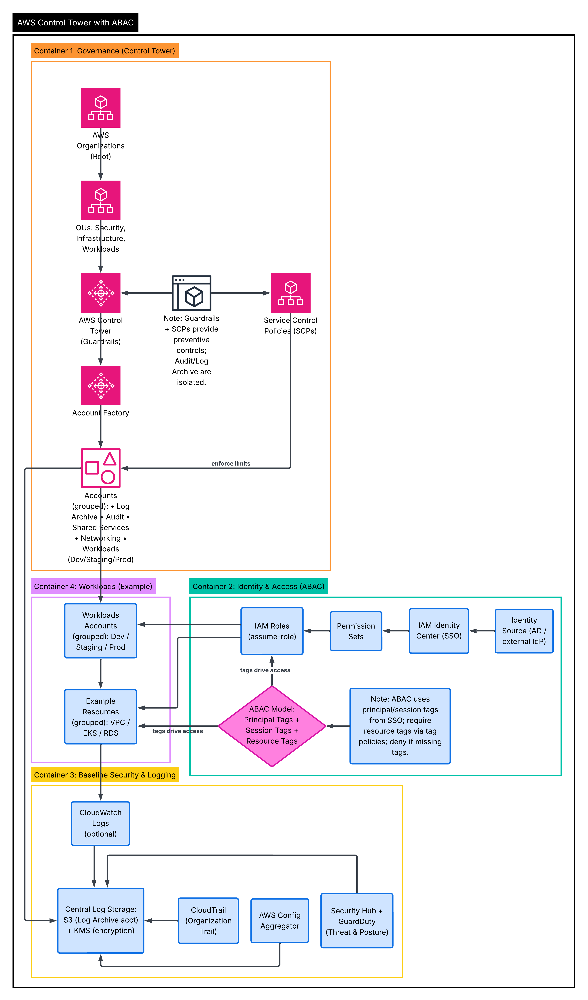

# AWS Control Tower with ABAC - Terraform



This directory is split into two phases because newly created AWS accounts cannot be reliably created and then immediately targeted with `assume_role` in the same apply.

- repository root: bootstrap for `AWS Organizations`, `OU`, `accounts`, and `SCP`
- `platform/`: post-bootstrap baseline for `IAM Identity Center`, `CloudTrail`, `Config`, `Security Hub`, and workload accounts

The architecture covers:

- AWS Organizations and an OU structure for `Security`, `Infrastructure`, and `Workloads`
- baseline SCPs for preventive controls
- IAM Identity Center permission sets with tag-based ABAC restrictions
- centralized log archive: `S3` + `KMS` + organization CloudTrail
- a baseline for AWS Config and Security Hub
- sample roles and tagged resources for workload accounts

## What Is Automated

Bootstrap phase:

- creation of the AWS Organization, OUs, and accounts
- creation and attachment of SCPs

Platform phase:

- creation of permission sets and assignments in IAM Identity Center
- configuration of the organization trail in CloudTrail
- creation of a centralized S3 bucket for logs and a KMS key
- configuration of an AWS Config aggregator
- enabling Security Hub in the audit account
- creation of ABAC-friendly IAM roles in workload accounts

## Important Notes

- AWS Control Tower landing zones and lifecycle guardrails are often managed by a separate bootstrap process. This stack models the architecture with Terraform resources and complements Control Tower rather than replacing its internal orchestration pipeline.
- A production-grade deployment typically uses separate provider aliases and bootstrap roles in the management, audit, log archive, and workload accounts. In this repository, that is handled in the second phase under `platform/`.
- ABAC in IAM Identity Center requires principal or session tags to come from the identity source or from SCIM/SAML attributes. In this stack, the permission sets and IAM policies are ready to use those tags, but the actual claim mappings in the external IdP must be configured separately.

## Structure

- `versions.tf` - Terraform and provider versions
- `providers.tf` - provider for the management account
- `variables.tf` - input variables for the bootstrap phase
- `locals.tf` - shared tags
- `main.tf` - bootstrap phase orchestration
- `platform/` - cross-account baseline after the accounts have been created
- `modules/governance` - Organizations, OUs, accounts, SCPs
- `modules/identity-center-abac` - permission sets, group assignments, ABAC policies
- `modules/logging-baseline` - S3/KMS/CloudTrail/Config/Security Hub
- `modules/workload-baseline` - IAM roles and an example tagged S3 bucket

## Run Order

### 1. Bootstrap

1. Copy the sample variables file:

```bash
cp terraform.tfvars.example terraform.tfvars
```

2. Fill in `management_role_arn` and `account_emails`.

3. Run:

```bash
terraform init
terraform fmt -recursive
terraform plan
terraform apply
```

4. Save the `organization_id` and `account_ids` outputs.

### 2. Platform

1. Go to `platform/`.

2. Copy `platform/terraform.tfvars.example` to `platform/terraform.tfvars`.

3. Fill in `organization_id`, `account_ids`, and the role ARNs for the accounts that were created in the bootstrap phase.

4. Run:

```bash
cd platform
terraform init
terraform fmt -recursive
terraform plan
```

## Minimum Prerequisites

- AWS Organizations trusted access enabled where required
- existing bootstrap roles in target accounts for `assume_role` during the platform phase
- IAM Identity Center enabled
- verified email addresses for new organization accounts

## Possible Extensions

- add actual network baseline modules for VPC, TGW, and Route53
- move GuardDuty delegated admin and organization configuration into a separate module
- add AWS Config recorder and delivery channel setup for each account
- integrate Control Tower Account Factory for Terraform if it is already used in your environment